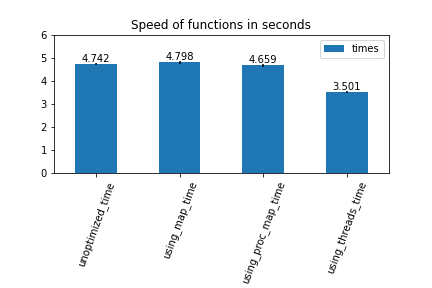

# Dataframe Function Speed Analysis
Testing a bunch of ways to apply a function to each item in a dataframe.

# Goal
Find the optimal way to apply different types of functions to a large dataframe.

# Results
Each test has been run 5 times, timed and averaged with the functions time_function, and time_average respectively.

